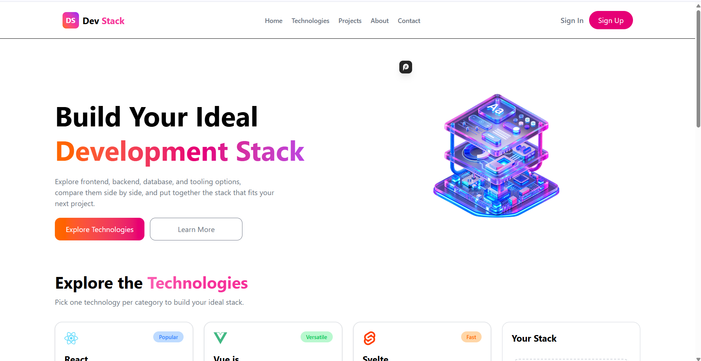

# Dev Stack

A responsive web application where developers can explore different development technologies and build their own technology stack.

## 📌 Project Overview

Dev Stack allows users to explore different frontend, backend, database, and development tools.

Users can view technology details, add technologies to their personal stack, remove individual technologies, and clear their selected stack.

## 📸 Screenshot



## 🛠️ Technologies Used

* React.js
* TypeScript
* Tailwind CSS
* React Icons
* React Toastify
* JSON
* Vite

## ✨ Main Features

### 1. Explore Technologies

Users can explore different frontend, backend, database, and development tools with their descriptions, categories, difficulty levels, ratings, and badges.

### 2. Build Your Own Stack

Users can add technologies to their personal stack and remove them whenever they want.

### 3. Responsive Design

The website is fully responsive and works on desktop, tablet, and mobile devices.

### 4. Technology Data

Technology information is loaded from a JSON file and displayed dynamically in the application.

### 5. Duplicate Prevention

Users cannot add the same technology to their stack more than once.

### 6. Toast Notifications

React Toastify is used to provide feedback when users add or remove technologies.

## 📦 Dependencies

Main dependencies used in this project:

* React
* React DOM
* React Icons
* React Toastify
* Tailwind CSS
* Vite
* TypeScript

## 🚀 Run Locally

### 1. Clone the repository

```bash
git clone https://github.com/tasmia-maha/DevStackAssignment.git
```

### 2. Navigate to the project folder

```bash
cd DevStackAssignment
```

### 3. Install dependencies

```bash
npm install
```

### 4. Start the development server

```bash
npm run dev
```

The application will then be available on the local development URL shown in your terminal.

## 🌐 Live Demo

Live demo will be added soon.

## 📁 Project Structure

```text
DevStackAssignment/
│
├── public/
├── src/
│   ├── components/
│   ├── data/
│   ├── types/
│   └── ...
│
├── package.json
├── vite.config.ts
├── tsconfig.json
└── README.md
```

## 🔗 Relevant Links

* GitHub Repository: https://github.com/tasmia-maha/DevStackAssignment

## 📚 React Questions & Answers

### 1. What is JSX, and why is it used in React?

JSX is a syntax that allows us to write HTML-like code inside JavaScript or TypeScript.

It makes React code easier to read and helps us create UI components more easily.

### 2. What is the difference between State and Props?

Props are used to pass data from a parent component to a child component.

State is data managed inside a component that can change over time.

For example, in this project, selected technologies are managed using state.

### 3. What is the use of useState in React?

`useState` is a React Hook used to create and manage changing data inside a component.

In this project, it is used to manage selected technologies, loading state, and the mobile menu state.

### 4. What is the use of useEffect in React?

`useEffect` is a React Hook used to perform side effects in a component.

In this project, it is used to load the technology data from the JSON file when the application starts.

### 5. Why is the key prop used in React lists?

The `key` prop helps React identify each item in a list.

It allows React to efficiently update, add, or remove list items when the data changes.

### 6. What is conditional rendering in React?

Conditional rendering means showing different UI based on a condition.

For example, in this project, if the stack is empty, it shows "Your Stack is empty". If technologies are selected, it displays the selected technologies instead.

### 7. How can you pass data from a child component to a parent component?

We can pass a function from the parent component to the child through props.

The child component can then call that function and send data back to the parent.

In this project, the technology card receives an `onAdd` function through props and uses it to add a technology to the user's stack.

## 👩‍💻 Author

**Mst Tasmia Akter**

CSE Student | Frontend Developer in Progress
